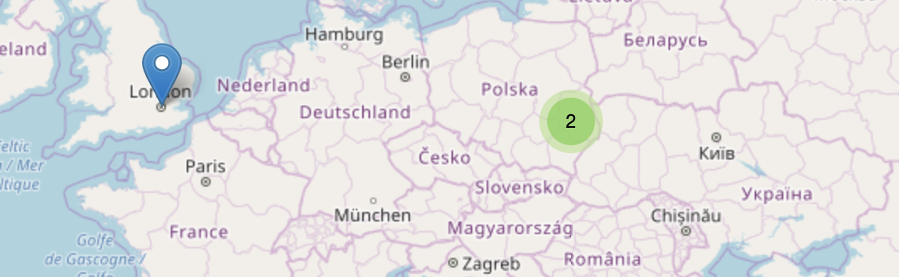

# React Leaflet Markercluster

Yet another `react-leaflet-markercluster` npm package. Why, there are already a dozen? I could not find one that worked with the latest version of `react-leaflet` and also seemed to support maintenance. I'm not a node developer but created this so that others could use an updated version and also maintain it. PR's are welcome. The fork-chain here is about a mile long so I've broken out of it, but listed the original developers below.

[](https://www.npmjs.com/package/react-leaflet-markercluster)
[](https://codeclimate.com/github/YUzhva/react-leaflet-markercluster)
[](https://www.npmjs.com/package/react-leaflet-markercluster)
[](#license)

React wrapper of [Leaflet.markercluster](https://github.com/Leaflet/Leaflet.markercluster)
for [react-leaflet](https://github.com/PaulLeCam/react-leaflet)



**Examples with the Documentation:** https://yuzhva.github.io/react-leaflet-markercluster/ <br />
**[CodeSandbox Getting Started](https://codesandbox.io/s/react-leaflet-markercluster-getting-started-9binx)**

# Description

If you are faced with an issue with markers overlapping during map zooming, or they are
overlapping because they are close to each other - you probably need to group them. <br />
That is what you can do with **react-leaflet-markercluster**.

Just grab your markers inside `<MarkerClusterGroup />` component, right after `<TileLayer />`:

```javascript
import MarkerClusterGroup from 'react-leaflet-markercluster';

<MarkerClusterGroup>
  <Marker position={[49.8397, 24.0297]} />
  <Marker position={[52.2297, 21.0122]} />
  <Marker position={[51.5074, -0.0901]} />
</MarkerClusterGroup>;
```

> **Note: Before getting started, please see these useful guides:**
>
> - [Leaflet Quick Start Guide](http://leafletjs.com/examples/quick-start/).
> - [react-leaflet Installation](https://react-leaflet.js.org/docs/en/installation.html).

# Table of Contents

- [Getting started](#getting-started)
- [API](#api)
- [How to run DEV env](#how-to-run-dev-env)
- [Contributors ✨](#contributors-)
- [Contributing](#contributing)
- [License](#license)

# Getting started

**1.** Install package:

```bash
yarn add react-leaflet-markercluster@next # yarn
npm install react-leaflet-markercluster # npm
```

**NOTE:** the `@next` is required for **react-leaflet v3** support. If you are still using react-leaflet v3, add dependency as `react-leaflet-markercluster@^2.x.x`

The `react-leaflet-markercluster` requires `leaflet.markercluster` as [`peerDependency`](https://docs.npmjs.com/files/package.json#peerdependencies)

(Leaflet and react-leaflet also should be installed)

```bash
yarn add leaflet.markercluster leaflet react-leaflet # yarn
npm install leaflet.markercluster leaflet react-leaflet # npm
```

**2.** Import **markercluster** and **leaflet** styles:

```javascript
@import '~leaflet/dist/leaflet.css'; // sass
@import '~react-leaflet-markercluster/dist/styles.min.css'; // sass

require('~leaflet/dist/leaflet.css'); // inside .js file
require('react-leaflet-markercluster/dist/styles.min.css'); // inside .js file
```

Or include CSS styles directly to the head of HTML file:

```html
<link rel="stylesheet" href="https://unpkg.com/leaflet/dist/leaflet.css" />

<link
  rel="stylesheet"
  href="https://unpkg.com/react-leaflet-markercluster/dist/styles.min.css"
/>
```

**3.** Write some simple `react-leaflet` Map:

```javascript
import { MapContainer, TileLayer, Marker } from 'react-leaflet';

<MapContainer
  className="markercluster-map"
  center={[51.0, 19.0]}
  zoom={4}
  maxZoom={18}
>
  <TileLayer
    url="https://{s}.tile.openstreetmap.org/{z}/{x}/{y}.png"
    attribution='&copy; <a href="http://osm.org/copyright">OpenStreetMap</a> contributors'
  />

  <Marker position={[49.8397, 24.0297]} />
  <Marker position={[52.2297, 21.0122]} />
  <Marker position={[51.5074, -0.0901]} />
</MapContainer>;
```

**NOTE:** Remember to add map styles `.markercluster-map { height: 90vh; }`.

**4.** Just grab your markers inside `<MarkerClusterGroup />` component, right after `<TileLayer />`:

```javascript
import MarkerClusterGroup from 'react-leaflet-markercluster';

<MarkerClusterGroup>
  <Marker position={[49.8397, 24.0297]} />
  <Marker position={[52.2297, 21.0122]} />
  <Marker position={[51.5074, -0.0901]} />
</MarkerClusterGroup>;
```

[More examples with the Documentation](https://yuzhva.github.io/react-leaflet-markercluster/) <br />
[CodeSandbox Getting Started](https://codesandbox.io/s/react-leaflet-markercluster-getting-started-9binx)

# API

Just pass whatever option you need from [All Leaflet.markercluster Options](https://github.com/Leaflet/Leaflet.markercluster#all-options) to `MarkerClusterGroup` as `prop`.

For example:

```javascript
<MarkerClusterGroup showCoverageOnHover={false} />
```

or:

```javascript
const createClusterCustomIcon = function (cluster) {
  return L.divIcon({
    html: `<span>${cluster.getChildCount()}</span>`,
    className: 'marker-cluster-custom',
    iconSize: L.point(40, 40, true),
  });
}

<MarkerClusterGroup iconCreateFunction={createClusterCustomIcon} />
```

P.S: Examples for v1 are available at [CHANGELOG.md](./CHANGELOG.md#v118)

### Event listeners

You are able to add any listener, supported by Leaflet, with simple `on` property prefix.

# How to run DEV env

**1.** Clone the repo:

```bash
git clone https://github.com/christopherpickering/react-leaflet-markercluster.git
```

**2.** Install all dependencies:

```bash
yarn install --no-lockfile # yarn
npm install # npm
```

**3.** Start the server:

```bash
yarn dev # yarn
npm run dev # npm
```

**4.** After starting the server, storybook should automatically open the following address:

```
http://localhost:8080/
```

# Contributors ✨

`react-leaflet-markercluster` was originally built by @yuzhva and then modified by @amauryfischer, @l4b4r4b4b4 and @changey before reaching this point. Many others have contributed as well.

**Special thanks to:**

- @webcarrot `react-leaflet` v2 support
- @CodeCutterUK `react-leaflet` v3 support
- @changey `react-leaflet` v4 support

# Contributing

All sources are placed in the `./src` folder:

**1.** Fork the repo.

**2.** Edit `react-leaflet-markercluster.js` plugin or `style.scss` style files.

**3.** Commit your changes and open Pull Request.

**Thank you for contribution**

# UMD

UMD builds are available on [unpkg](https://unpkg.com/):

```html
<!-- unpkg, production code (minified) -->
<script src="https://unpkg.com/react-leaflet-markercluster/dist/index.js"></script>
<!-- unpkg, development code -->
<script src="https://unpkg.com/react-leaflet-markercluster/src/react-leaflet-markercluster.js"></script>

<!-- unpkg, production styles (minified) -->
<link
  rel="stylesheet"
  type="text/css"
  href="https://unpkg.com/react-leaflet-markercluster/dist/styles.min.css"
/>
<!-- unpkg, development styles -->
<link
  rel="stylesheet"
  type="text/css"
  href="https://unpkg.com/react-leaflet-markercluster/src/styles.scss"
/>
```

# License

MIT License, see [LICENSE](https://github.com/christopherpickering/react-leaflet-markercluster/blob/master/LICENSE) file.
MIT License, see [LICENSE](https://github.com/changey/react-leaflet-markercluster/blob/master/LICENSE) file.
MIT License, see [LICENSE](https://github.com/l4b4r4b4b4/react-leaflet-markercluster/blob/master/LICENSE) file.
MIT License, see [LICENSE](https://github.com/amauryfischer/react-leaflet-markercluster/blob/master/LICENSE) file.
MIT License, see [LICENSE](https://github.com/YUzhva/react-leaflet-markercluster/blob/master/LICENSE) file.
